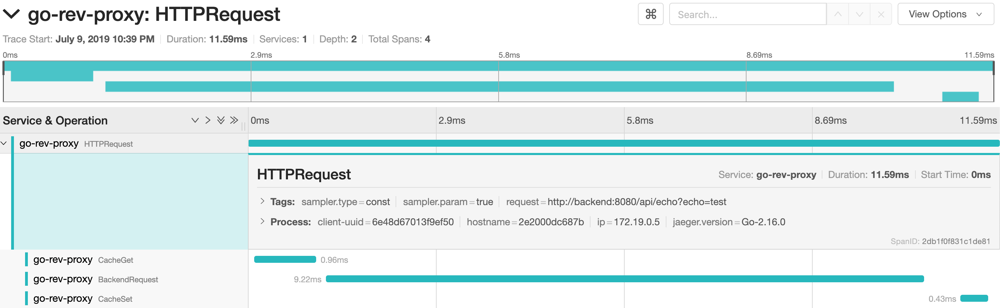

# go-rev-proxy

This simple project was meant to be an opportunity to play with a handful of enterprise technologies.  It is a reverse proxy written in Go with support for Redis caching, Prometheus metrics and distributed tracing.

### Running the Application

After cloning the repo run `docker-compose build && docker-compose up` to build and start the application with all its supporting services.  Exercise the reverse proxy by querying the application through it:

```
$ curl http://localhost:8080/api/fibonacci?pos=10000
2132534333
$ curl http://localhost:8080/api/echo?echo=test
test
```

### OpenTracing

Navigate to the Jaeger UI at `http://localhost:16686/` to see some traces:



### Prometheus Metrics

Prometheus metrics are available in the usual spot:

```
$ curl http://localhost:8080/metrics
# HELP go_rev_proxy_requests_latency_ms Summary of Request Latency (ms)
# TYPE go_rev_proxy_requests_latency_ms summary
go_rev_proxy_requests_latency_ms{path="/api/echo",quantile="0.5"} 1
go_rev_proxy_requests_latency_ms{path="/api/echo",quantile="0.9"} 11
go_rev_proxy_requests_latency_ms{path="/api/echo",quantile="0.99"} 11
go_rev_proxy_requests_latency_ms_sum{path="/api/echo"} 15
go_rev_proxy_requests_latency_ms_count{path="/api/echo"} 6
go_rev_proxy_requests_latency_ms{path="/api/fibonacci",quantile="0.5"} 1
go_rev_proxy_requests_latency_ms{path="/api/fibonacci",quantile="0.9"} 300
go_rev_proxy_requests_latency_ms{path="/api/fibonacci",quantile="0.99"} 300
go_rev_proxy_requests_latency_ms_sum{path="/api/fibonacci"} 303
go_rev_proxy_requests_latency_ms_count{path="/api/fibonacci"} 6
```

### Redis

Logging shows the impact of caching

```
proxy_1    | Starting Request http://backend:8080/api/echo?echo=test
proxy_1    | Caching: Miss http://backend:8080/api/echo?echo=test
proxy_1    | Ending Request http://backend:8080/api/echo?echo=test
proxy_1    | 2019/07/10 02:39:58 HTTPRequest took 11.4113ms
proxy_1    | Starting Request http://backend:8080/api/echo?echo=test
proxy_1    | Caching: Hit http://backend:8080/api/echo?echo=test
proxy_1    | Ending Request http://backend:8080/api/echo?echo=test
proxy_1    | 2019/07/10 02:39:58 HTTPRequest took 1.0331ms
```

### Final Thoughts

Overall this turned into a fun project that allowed for some basic exploration of go, caching, tracing and other technologies.  This code should never be used in any real world scenario.  However, if you're interested in doing similar things you may find some useful sample code buried in here.

Improvements that could be made:

- Respect incoming OpenTracing headers
- Set outgoing OpenTracing headers
- Add distributed rate limiting through Redis
- Make caching, tracing, etc. configurable